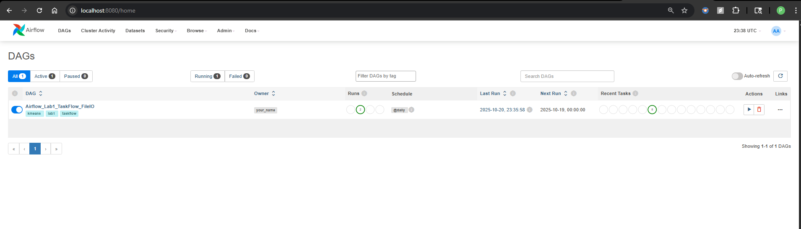
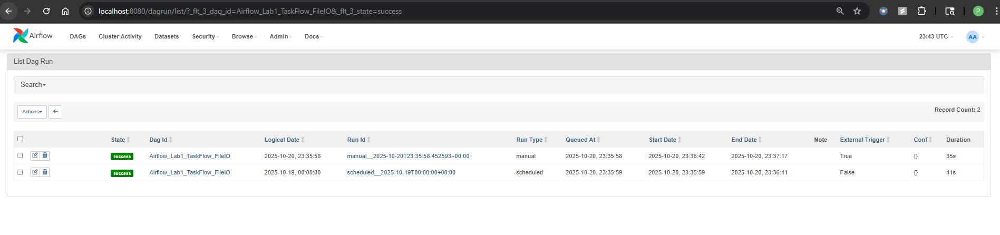
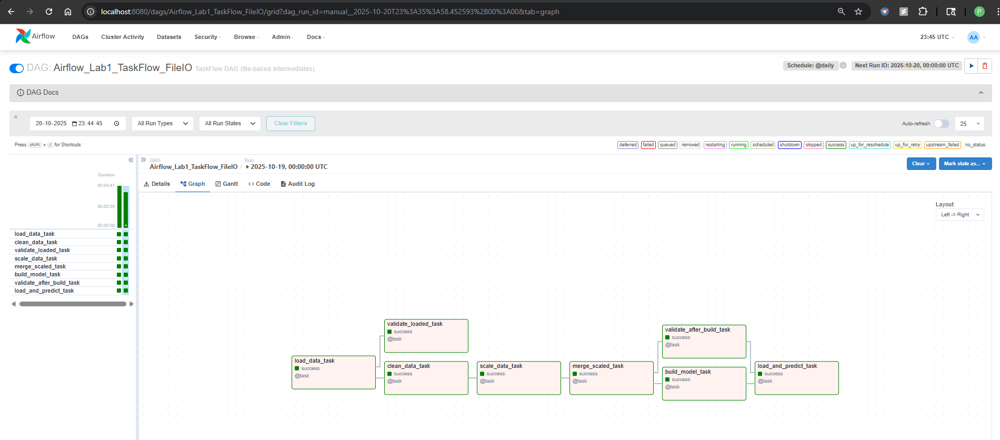
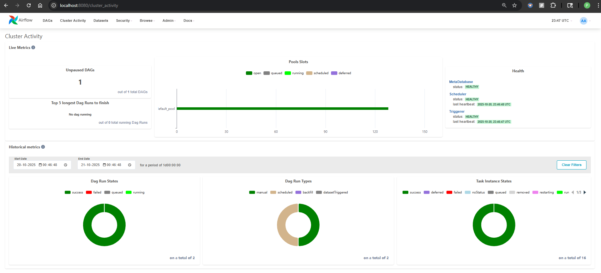

# Airflow Lab 1

* To install Airflow using Docker, watch our [Airflow Lab1 Tutorial Video](https://youtu.be/exFSeGUbn4Q?feature=shared)
* For the latest step-by-step instructions, check out this blog: [AirFlow Lab-1](https://www.mlwithramin.com/blog/airflow-lab1)

---

## ML Model Overview

This project implements a **K-Means clustering pipeline** with **elbow method** for selecting the optimal number of clusters. It uses a **file-based TaskFlow DAG** in Airflow for modular preprocessing, scaling, model building, and prediction. All intermediate artifacts are stored as files (`.pkl` or `.npy`) to avoid XCom pickling issues.

### Features

* Load CSV data and save as pickled DataFrame.
* Clean and validate loaded data.
* Scale features with `MinMaxScaler`.
* Merge scaled data for modeling.
* Build K-Means clustering model and save it.
* Validate preprocessing and model artifacts.
* Predict on test data with the saved model.
* Fully file-based workflow (avoids XCom pickling errors).

---

## Prerequisites

Install the following Python libraries:

```bash
pip install pandas scikit-learn kneed numpy
```

Optional:

```bash
pip install apache-airflow
```

---

## `lab.py` Functions

All functions now **ensure required columns** `["BALANCE", "PURCHASES", "CREDIT_LIMIT"]` are present and CSVs are validated before processing.

### 1. `load_data_file() -> str`

* Loads `data/file.csv`, pickles the DataFrame, and returns path.
* Raises an error if required columns are missing.

### 2. `clean_data_file(loaded_path: str) -> str`

* Loads pickled data, drops NA, keeps only required columns, saves as `cleaned.pkl`.

### 3. `validate_loaded_file(loaded_path: str) -> dict`

* Returns JSON-safe dict with row/column counts and sample data.

### 4. `scale_data_file(cleaned_path: str) -> str`

* Scales cleaned data using `MinMaxScaler`.
* Saves numpy array to `scaled.npy` and scaler to `scaler.pkl`.

### 5. `merge_scaled_file(scaled_path: str) -> str`

* Passthrough merge step (returns scaled_path).

### 6. `build_save_model_file(scaled_path: str, filename: str = "model.sav") -> Tuple[list, str]`

* Builds K-Means for k=1..49.
* Returns SSE list and saved model path.

### 7. `validate_after_build_file(merged_path: str) -> dict`

* Returns diagnostics of preprocessed data.

### 8. `load_model_elbow_file(filename_or_path: str, sse: list) -> int`

* Loads model from file, validates test CSV columns, predicts first value.
* Raises errors if required columns are missing in test CSV.

---

## Airflow Setup

Airflow orchestrates this ML pipeline as a **TaskFlow DAG** with parallel and sequential tasks:

* `load_data_task`
* `clean_data_task` (parallel with validation)
* `validate_loaded_task`
* `scale_data_task`
* `merge_scaled_task`
* `build_model_task` (parallel with post-build validation)
* `validate_after_build_task`
* `load_and_predict_task`

### Installation

* Allocate ≥4GB memory for Docker (ideally 8GB).
* Local: Docker Desktop installed and running.
* Cloud: Linux VM with Docker Engine ([install script](https://docs.docker.com/engine/install/ubuntu/#install-using-the-convenience-script)).

### Docker Compose

1. Create project directory:

```bash
mkdir -p ~/app
cd ~/app
```

2. Fetch Docker Compose YAML:

```bash
curl -LfO 'https://airflow.apache.org/docs/apache-airflow/2.5.1/docker-compose.yaml'
```

3. Setup directories and environment:

```bash
mkdir -p ./dags ./logs ./plugins ./data ./model
echo -e "AIRFLOW_UID=$(id -u)" > .env
```

4. Modify docker-compose.yaml:

```yaml
# Disable example DAGs
AIRFLOW__CORE__LOAD_EXAMPLES: 'false'

# Additional packages
_PIP_ADDITIONAL_REQUIREMENTS: ${_PIP_ADDITIONAL_REQUIREMENTS:- pandas scikit-learn kneed numpy}

# Mount working data
- ${AIRFLOW_PROJ_DIR:-.}/data:/opt/airflow/data
- ${AIRFLOW_PROJ_DIR:-.}/model:/opt/airflow/model

# Admin credentials
_AIRFLOW_WWW_USER_USERNAME: ${_AIRFLOW_WWW_USER_USERNAME:-airflow2}
_AIRFLOW_WWW_USER_PASSWORD: ${_AIRFLOW_WWW_USER_PASSWORD:-airflow2}
```

5. Initialize Airflow DB:

```bash
docker compose up airflow-init
```

6. Run Airflow:

```bash
docker compose up
```

7. Access Web UI: `http://localhost:8080`, log in with credentials from `.env`.

---

## Airflow DAG Script (`dags/airflow.py`)

The DAG uses **TaskFlow API** and **file-based intermediates**:

```python
# Load -> Clean + Validate -> Scale -> Merge -> Build + Validate -> Load/Predict
loaded_path = t_load_data()
cleaned_path = t_clean_data(loaded_path)
validated_loaded = t_validate_loaded(loaded_path)
scaled_path = t_scale_data(cleaned_path)
merged_path = t_merge_scaled(scaled_path)
build_info = t_build_model(merged_path)
validated_after_build = t_validate_after_build(merged_path)
final_prediction = t_load_and_predict(build_info)

# Explicit TaskFlow dependencies
loaded_path >> [cleaned_path, validated_loaded]
cleaned_path >> scaled_path >> merged_path
merged_path >> [build_info, validated_after_build] >> final_prediction
```

### Notes

* All intermediate artifacts are **files** (`.pkl` or `.npy`) to avoid XCom pickling errors.
* Required columns are enforced at each step.
* Validation tasks run **in parallel** to cleaning or building tasks.
* Test CSV (`data/test.csv`) must have the same columns as training data (`BALANCE`, `PURCHASES`, `CREDIT_LIMIT`).

---

## Running the Pipeline

1. Trigger DAG from Airflow Web UI.
2. Monitor task progress and logs.
3. Check output files in `data/` and `model/` directories.
4. Final prediction is returned by `load_and_predict_task`.

---



