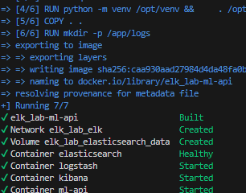
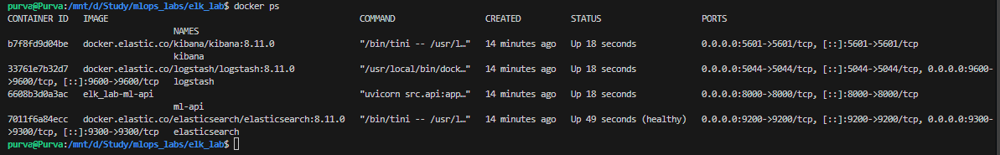
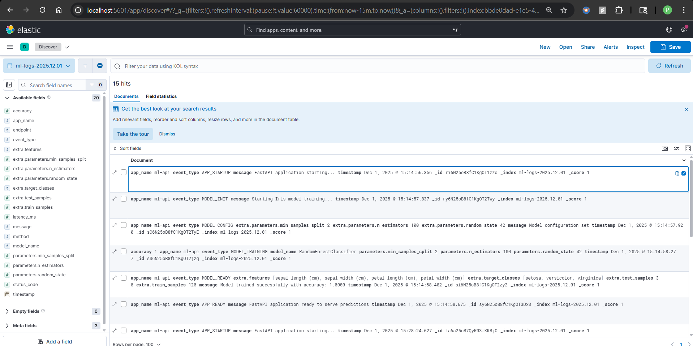
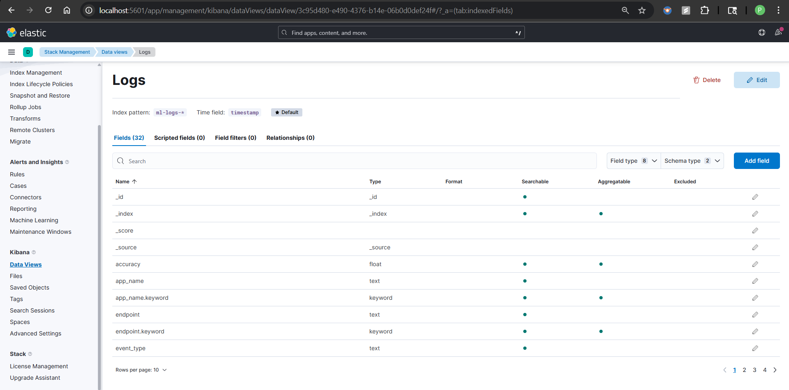
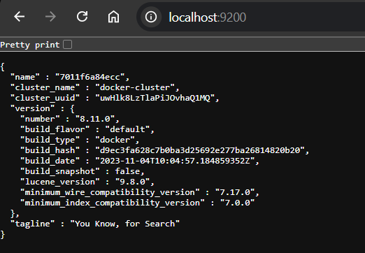
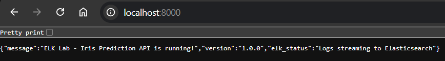
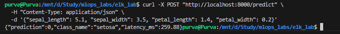

# ELK Lab - ML API with Centralized Logging

## Overview

This lab integrates a **FastAPI ML prediction API** with the **ELK Stack** (Elasticsearch, Logstash, Kibana) to demonstrate centralized logging and monitoring for ML operations.

**What is done:**
- Sending structured logs from Python to Elasticsearch
- Logging ML predictions, model training, and API requests
- Visualizing logs in Kibana dashboards

**Architecture:**
```
ML API (FastAPI) → Elasticsearch → Kibana (Dashboard)
```

## Prerequisites

- Docker & Docker Compose installed
- WSL: Run `sudo sysctl -w vm.max_map_count=262144` before starting

## Run the Lab

```bash
# Start all services
cd elk_lab
docker compose up -d

# Wait ~1-2 minutes, then verify
docker compose ps
```

## Access Services

| Service       | URL                    |
|---------------|------------------------|
| ML API        | http://localhost:8000  |
| Kibana        | http://localhost:5601  |
| Elasticsearch | http://localhost:9200  |

## Test the API

```bash
# Health check
curl http://localhost:8000/health

# Make a prediction
curl -X POST http://localhost:8000/predict \
  -H "Content-Type: application/json" \
  -d '{"sepal_length": 5.1, "sepal_width": 3.5, "petal_length": 1.4, "petal_width": 0.2}'
```

## View Logs in Kibana

1. Open http://localhost:5601
2. Go to **Stack Management** → **Index Patterns** → Create `ml-logs-*`
3. Go to **Discover** to view logs

## Screenshots

| Screenshot |
|------------|
|  |
| |
|  |
|  |
|  |
|  |
|  |


## Stop the Lab

```bash
docker compose down      # Stop services
docker compose down -v   # Stop and clear data
```

## Code Overview
### `src/elk_logger.py` - Elasticsearch Logger
Custom logger class that sends structured JSON logs to Elasticsearch:
- Connects to Elasticsearch on startup
- `log_event()` - General events (APP_STARTUP, MODEL_READY)
- `log_prediction()` - Logs input features, prediction, latency
- `log_model_training()` - Logs model name, accuracy, hyperparameters
- `log_api_request()` - Logs endpoint, method, status code, latency
### `src/train.py` - Model Training
Trains a RandomForest classifier on Iris dataset with ELK logging:
- Logs `MODEL_INIT` when training starts
- Logs `MODEL_CONFIG` with hyperparameters
- Logs `MODEL_TRAINING` with final accuracy
- Logs `MODEL_READY` with dataset metadata
### `src/api.py` - FastAPI Application
REST API with automatic request logging middleware:
- `@app.middleware("http")` - Logs every request to Elasticsearch
- `GET /` - Home endpoint
- `GET /health` - Health check with model status
- `POST /predict` - Iris prediction with latency tracking
- `GET /logs/stats` - Elasticsearch index info
### `docker-compose.yml` - Service Orchestration
Defines 4 services:
- `elasticsearch` - Log storage (port 9200)
- `logstash` - Log pipeline (port 5044)
- `kibana` - Visualization UI (port 5601)
- `ml-api` - FastAPI app (port 8000)
## Files

```
elk_lab/
├── docker-compose.yml   # ELK + API services
├── src/
│   ├── api.py           # FastAPI endpoints
│   ├── train.py         # Model training
│   └── elk_logger.py    # Elasticsearch logger
└── logstash/pipeline/   # Logstash config
```
